<div align="center">

# paddyguard — Weather-Aware Paddy Leaf Disease Detection with an Honest Ablation

**paddyguard is a paddy (rice) leaf disease classifier for researchers who want to test if weather helps image models. It takes leaf images and their field, location and date through these steps to a seeded image-versus-weather ablation:**

`validate` → `group fields and duplicates` → `lagged weather` → `train` → `evaluate once` → `compare variants`.


**[Summary](#1-summary)** ·
**[Workflow](#4-the-end-to-end-workflow)** ·
**[Run it](#14-how-to-run-paddyguard)** ·
**[Configuration](#144-environment-variables)** ·
**[Known problems](#17-known-problems)** ·
**[Glossary](#19-glossary)**

</div>

> [!NOTE]
> This README uses ASD-STE100 Simplified Technical English. The writing rules and the project
> vocabulary are in [`docs/ste-style-guide.md`](docs/ste-style-guide.md). Each term in the
> [Glossary](#19-glossary) has only one meaning.

---

paddyguard classifies paddy leaf images into disease classes and tests one claim: does weather before the photo help the classifier?
Each image gets weather features from its own location in the 14 days before its date. If the metadata has no location and date, the weather branch is off. paddyguard never tiles one weather vector to all images.
Images of one field and near-duplicate shots stay in one split. Augmentation runs on the fly on training images only.
The ablation trains the image-only, weather-only and image + weather variants on the same splits and seeds, and compares them with a paired bootstrap.

This README is the **one location that explains all of paddyguard**. It gives these topics:

- the general design
- each component and its procedure, step by step
- the decision rules
- the data map
- the runbook
- the validation results and the known problems

| If you are… | Read |
|---|---|
| A manager or reviewer | [1](#1-summary), [3](#3-design-rules), [4](#4-the-end-to-end-workflow), [16](#16-validation-results), [18](#18-key-points) |
| A developer who joins the project | All sections, in sequence. Keep [14](#14-how-to-run-paddyguard) and [17](#17-known-problems) open while you work |
| A researcher who runs paddyguard | [14](#14-how-to-run-paddyguard), then the section for the component that you use |

---

## Table of contents

1. 🧭 [Summary](#1-summary)
2. 🏗️ [How paddyguard is built](#2-how-paddyguard-is-built)
   - 2.1 [Components](#21-components)
   - 2.2 [System context](#22-system-context)
   - 2.3 [Repository layout](#23-repository-layout)
3. 🛡️ [Design rules](#3-design-rules)
4. 🔄 [The end-to-end workflow](#4-the-end-to-end-workflow)
   - 4.1 [Full flow](#41-full-flow)
   - 4.2 [The life cycle of one image](#42-the-life-cycle-of-one-image)
   - 4.3 [Who does which step](#43-who-does-which-step)
5. 🔵 [Metadata and the class list](#5-metadata-and-the-class-list)
6. 🌦️ [Weather features](#6-weather-features)
7. 🟢 [Groups and splits](#7-groups-and-splits)
8. 🌫️ [Augmentations](#8-augmentations)
9. 🟣 [The CPU ablation](#9-the-cpu-ablation)
10. 🤖 [Torch models and two-phase fine-tuning](#10-torch-models-and-two-phase-fine-tuning)
11. 📏 [Metrics and comparisons](#11-metrics-and-comparisons)
12. ⚖️ [The decision rules](#12-the-decision-rules)
13. 🗂️ [Data and file map](#13-data-and-file-map)
14. ▶️ [How to run paddyguard](#14-how-to-run-paddyguard)
    - 14.1 [Prerequisites](#141-prerequisites) · 14.2 [Installation](#142-installation) · 14.3 [Run paddyguard](#143-run-paddyguard) · 14.4 [Environment variables](#144-environment-variables)
15. 🧩 [How to extend paddyguard](#15-how-to-extend-paddyguard)
16. ✅ [Validation results](#16-validation-results)
17. ⚠️ [Known problems](#17-known-problems)
18. 📌 [Key points](#18-key-points)
19. 📖 [Glossary](#19-glossary)
20. 📄 [License](#20-license)

---

## 1. Summary

**The problem.** A weather input can only help if it describes the place and the time of each photo. These questions are difficult:

- Where does the weather for each image come from, and how do you stop a constant weather vector?
- How do you keep augmented copies and near-duplicate shots out of validation and test?
- How do you keep one pixel scale from the file to the backbone?
- How do you show that weather adds value, with seeds and a confidence interval?
- How do you run the full path on a laptop with no GPU and no key?

paddyguard gives each of these questions its own component. Each component has a validated input and a tested output.

| Item | Value |
|---|---|
| Input | `metadata.csv` and the images. Location and date are optional |
| Output | Weather features, ablation JSON (three variants, seeds, CIs, paired comparison, robustness), torch runs with checkpoints |
| Components | **10** modules: config, metadata, weather, images, augment, splits, evaluate, baseline, deep, synthetic, plus the CLI |
| Weather providers | `offline` (synthetic climate) and `open-meteo` (historical archive, no key) |
| Backbones | `tiny_cnn` (CPU), `efficientnet_v2_s`, `convnext_tiny` (torchvision) |
| Offline mode | Synthetic images, offline weather, the CPU ablation and all tests. No download, no key, no GPU |
| Safety | No constant weather. Field and duplicate groups never cross a split. Augmentation on training images only |
| Tests | **36** pass in CI (`.[dev]` only). The torch module (6 tests) skips there. With the `torch` extra, all 42 pass |

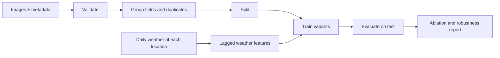

---

## 2. How paddyguard is built

### 2.1 Components

| Component | Module | Purpose |
|---|---|---|
| Settings | `src/paddyguard/config.py` | Environment variables: folders, seed, image size, provider, cache, lag, device |
| Metadata | `src/paddyguard/metadata.py` | Schema checks, default paths, sorted class list, weather availability |
| Weather | `src/paddyguard/weather.py` | Providers, cache, lagged window features, constant check |
| Images | `src/paddyguard/images.py` | Streaming loader, image features, thumbnail signatures |
| Augmentations | `src/paddyguard/augment.py` | Six weather-style augmentations and `RandomWeather` |
| Splits | `src/paddyguard/splits.py` | Near-duplicate groups, split groups, seeded grouped splits |
| Metrics | `src/paddyguard/evaluate.py` | Macro-F1, recall, confusion matrix with names, ECE, bootstraps |
| CPU ablation | `src/paddyguard/baseline.py` | Image, weather and image + weather variants, robustness test |
| Torch models | `src/paddyguard/deep.py` | Backbones, `FusionNet` (none, late, FiLM), two-phase training |
| Synthetic data | `src/paddyguard/synthetic.py` | Drawn leaves, fields, dates and a weather-driven class mix |
| CLI | `src/paddyguard/cli.py` | `synth`, `validate`, `weather`, `ablation`, `train`, `augment-preview`, `demo` |

The component map shows which module calls which module. An arrow points from the caller to the module that it uses.

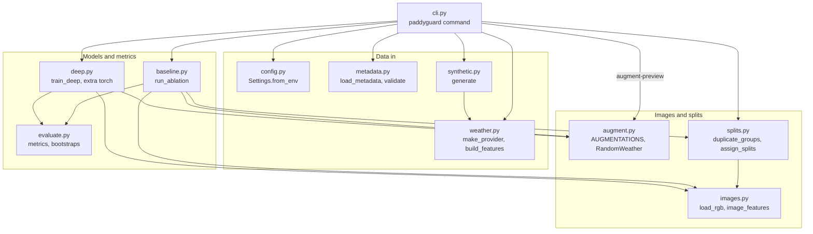

### 2.2 System context

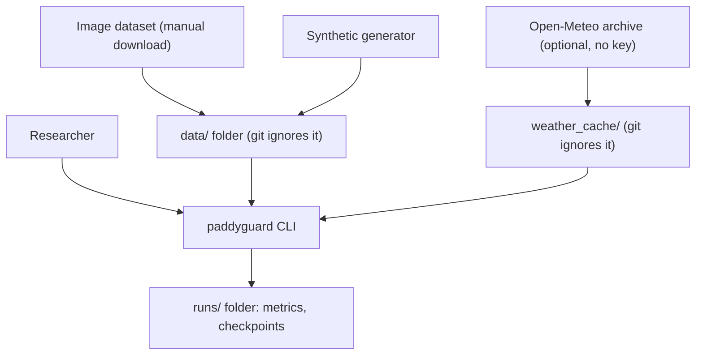

### 2.3 Repository layout

```
paddyguard/
├── .github/workflows/ci.yml     # CI: install .[dev], run pytest
├── data/README.md               # image and weather sources, layout, columns
├── docs/ste-style-guide.md      # writing rules and project vocabulary
├── src/paddyguard/
│   ├── config.py                # settings from environment variables
│   ├── metadata.py              # metadata schema and class list
│   ├── weather.py               # providers, cache, lagged features
│   ├── images.py                # loader, features, signatures
│   ├── augment.py               # weather-style augmentations
│   ├── splits.py                # duplicate groups and grouped splits
│   ├── evaluate.py              # metrics and bootstraps
│   ├── baseline.py              # CPU ablation and robustness test
│   ├── deep.py                  # torch models and training (optional)
│   ├── synthetic.py             # synthetic data
│   └── cli.py                   # command-line interface
├── tests/                       # 42 tests (6 need torch)
├── .env.example                 # variable names only, no key
└── pyproject.toml               # package, extras, console script
```

---

## 3. Design rules

### 3.1 Weather belongs to each image

`weather.build_features` gets the daily weather at the location of each image and takes the window before its date. `assert_informative` stops the run if a weather feature has one value for all images. If the metadata has no location and date, the weather branch is off.

### 3.2 No future weather

The window ends one day before the photo date. The weather of the photo day and of later days never enters the features.

### 3.3 Splits come before augmentation

`assign_splits` makes the test and validation splits from the original images. Augmentation runs inside the training data loader only. Thus no augmented copy of a training image can reach validation or test.

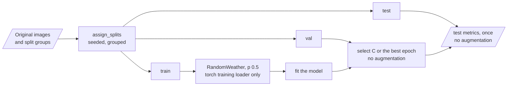

### 3.4 Fields and near-duplicates stay together

`split_groups` joins images that share a `field_id` or a near-duplicate link. `StratifiedGroupKFold` splits these groups. `assert_no_overlap` stops the run if a group crosses a split.

### 3.5 One pixel contract

`load_rgb` returns float32 RGB in [0, 1]. Each augmentation checks this contract and refuses other inputs. The torch dataset applies the ImageNet normalization once, after augmentation.

### 3.6 Same splits, same seeds, same model family

The ablation trains each variant on the same split for each seed, with the same model family. The test split measures each variant once. A paired bootstrap over split groups compares image + weather with image only.

### 3.7 No key, no secret

The Open-Meteo archive needs no key. paddyguard reads no API key, and `.env.example` contains no value.

---

## 4. The end-to-end workflow

### 4.1 Full flow

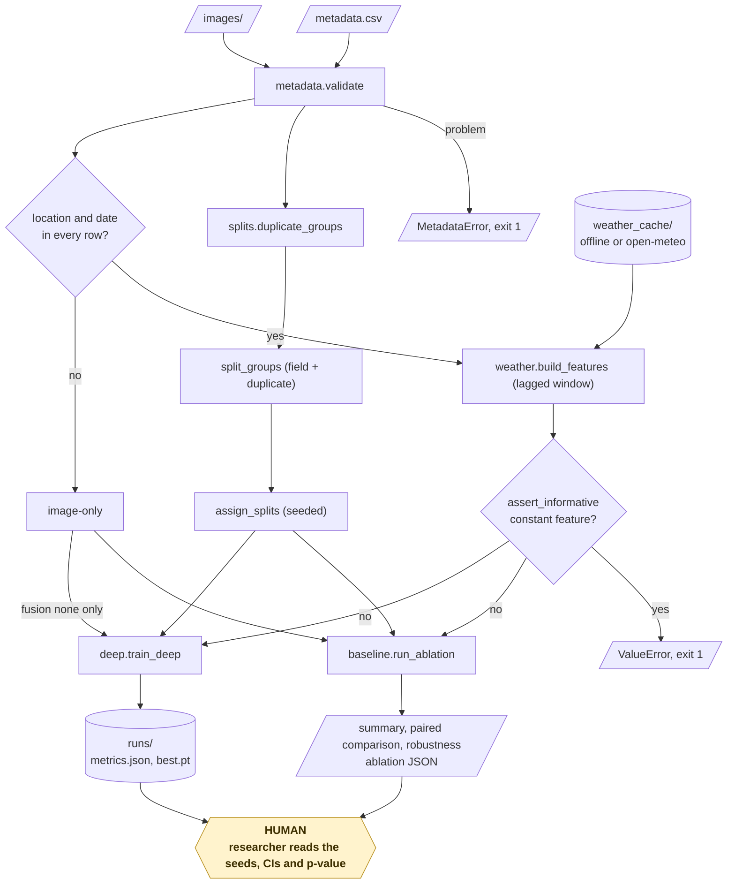

### 4.2 The life cycle of one image

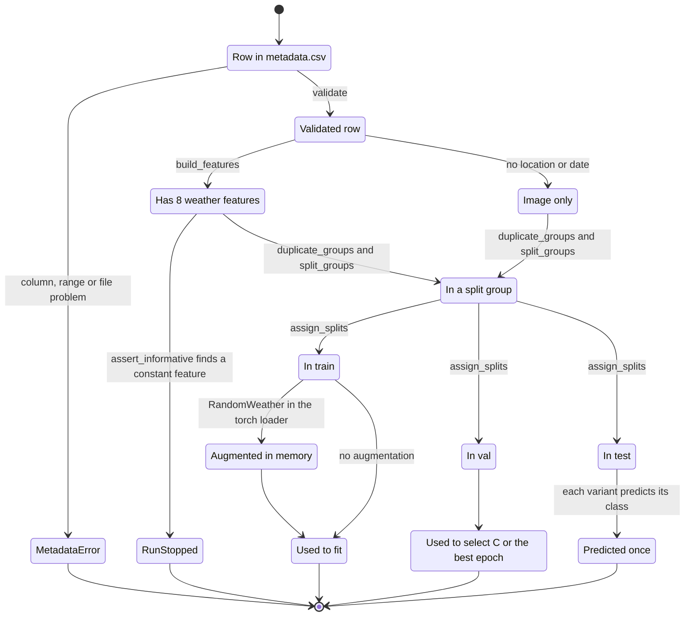

1. `validate` checks its `image_id`, label, file, location and date.
2. `duplicate_groups` compares its thumbnail signature with the other images of its class.
3. `split_groups` gives it the group of its field and of its near-duplicates.
4. `build_features` gives it 8 weather features from the 14 days before its date.
5. The split puts the image, with its whole group, in `train`, `val` or `test`.
6. If the image is in `train`, the loader can change it with one random augmentation.
7. If the image is in `test`, each variant predicts its class once.

### 4.3 Who does which step

The sequence shows the `ablation` command on data with a location and a date for each image.

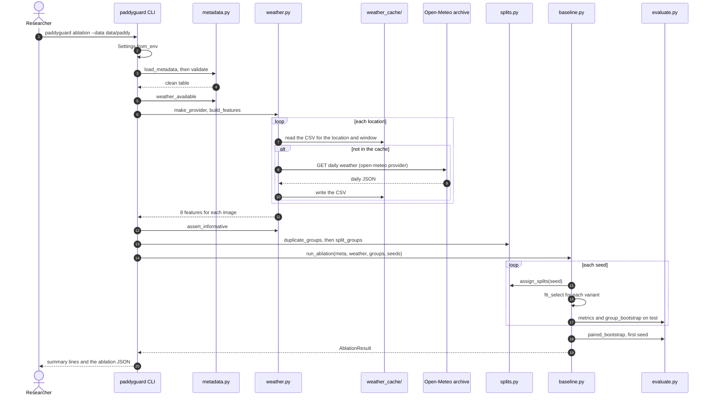

---

## 5. Metadata and the class list

**Purpose.** Make a clean metadata table and one fixed class list.

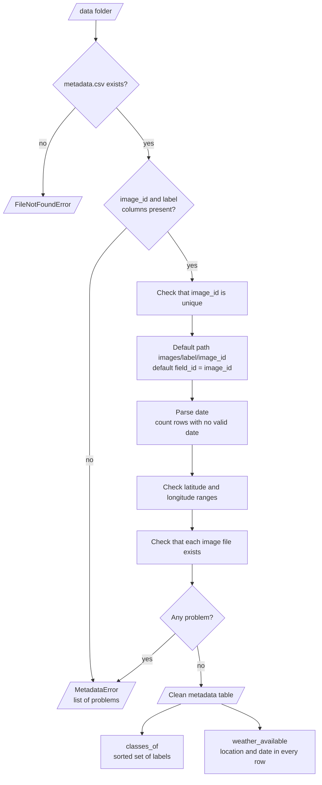

| Input | Output |
|---|---|
| `metadata.csv` | Table with `image_id`, `label`, `path`, `field_id`, optional `latitude`, `longitude`, `date` |

**Procedure**

1. Check that `image_id` and `label` exist and that `image_id` is unique.
2. If `path` is missing, use `images/<label>/<image_id>`.
3. If `field_id` is missing, each image is its own field.
4. Parse `date` and check the ranges of `latitude` (−90 to 90) and `longitude` (−180 to 180).
5. Check that each image file exists.

The class list is the sorted set of labels. It never depends on the order of a folder listing.

---

## 6. Weather features

**Purpose.** Give each image the weather of its own place in the days before its photo.

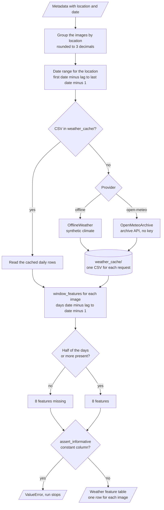

| Input | Output |
|---|---|
| Metadata with location and date, a provider | 8 features for each image |

**Procedure**

1. Group the images by location (rounded to 3 decimals).
2. For each location, get the daily weather from the earliest window start to the latest window end.
3. For each image, take the days from date − 14 to date − 1.
4. Calculate the 8 features in the table below. If fewer than half of the days exist, the features are missing.
5. Check that no feature is constant over all images.

| Feature | Meaning |
|---|---|
| `w_tmean`, `w_tmax`, `w_tmin` | Mean of the daily mean, maximum and minimum temperature (°C) |
| `w_rh` | Mean daily relative humidity (%) |
| `w_precip_total` | Total precipitation (mm) |
| `w_rainy_days` | Days with 1 mm or more of precipitation |
| `w_humid_days` | Days with a mean relative humidity of 90% or more |
| `w_wind` | Mean of the daily maximum wind speed |

| Provider | Source | Network |
|---|---|---|
| `offline` | Deterministic synthetic climate from latitude, longitude and day | No |
| `open-meteo` | Open-Meteo historical archive API, standard library HTTP | Yes, cached in `weather_cache/` |

---

## 7. Groups and splits

**Purpose.** Make splits where no field and no near-duplicate shot crosses a split.

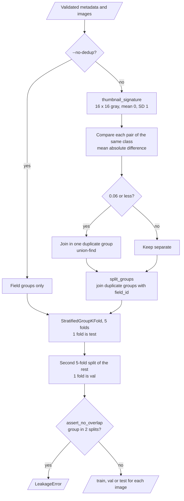

**Procedure**

1. Make a 16 × 16 gray thumbnail of each image, scaled to mean 0 and standard deviation 1.
2. Join two images of the same class if the mean absolute difference of their thumbnails is 0.06 or less.
3. Join each image group with its field.
4. Take one fold of a 5-fold `StratifiedGroupKFold` as `test` (about 20%).
5. Take one fold of a second 5-fold split of the rest as `val` (about 16% of all images).
6. Check that no group is in two splits.

The `validate` command prints the number of near-duplicate groups with 2 or more images.

---

## 8. Augmentations

`RandomWeather` applies the augmentations in the torch training loader. Each call does these steps:

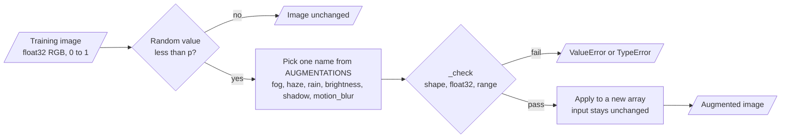

| Name | Change |
|---|---|
| `fog` | Blend with light gray, strength 0.2–0.5 |
| `haze` | Vertical gradient of light haze, stronger at the top |
| `rain` | Short light diagonal streaks, then 10% darker |
| `brightness` | Multiply by 0.7–1.3 |
| `shadow` | Darken one vertical band by a factor of 0.4–0.7 |
| `motion_blur` | Horizontal line kernel of 3–7 pixels |

`RandomWeather(p, seed)` applies one random augmentation with probability `p` (default 0.5 in training). Each function checks the pixel contract, returns a new array and leaves its input unchanged. The `augment-preview` command writes one image with each augmentation.

---

## 9. The CPU ablation

**Purpose.** Test if weather helps, with no deep learning framework.

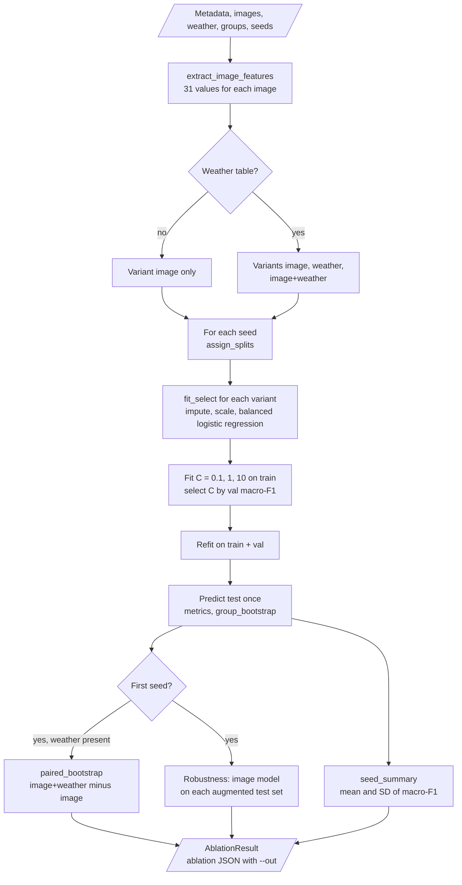

| Input | Output |
|---|---|
| Metadata, images, weather features, groups, seeds | Macro-F1 of each variant and seed with CIs, mean ± standard deviation, paired comparison, robustness table |

**Procedure**

1. Make 31 image features for each image: HSV histograms (3 × 8 bins), shares of green, brown, yellow and pale pixels, and gradient and contrast statistics.
2. For each seed, make the splits.
3. For each variant, fit a scaler and a balanced logistic regression with C = 0.1, 1 and 10 on `train`. Select C by macro-F1 on `val`.
4. Refit on `train` + `val` with the selected C, and evaluate once on `test`.
5. For the first seed, compare image + weather with image only by a paired bootstrap over split groups.
6. For the first seed, run the image model on the test images after each augmentation.

| Variant | Features |
|---|---|
| `image` | 31 image features |
| `weather` | 8 weather features |
| `image+weather` | 39 features |

---

## 10. Torch models and two-phase fine-tuning

**Purpose.** Train a backbone with or without weather fusion.

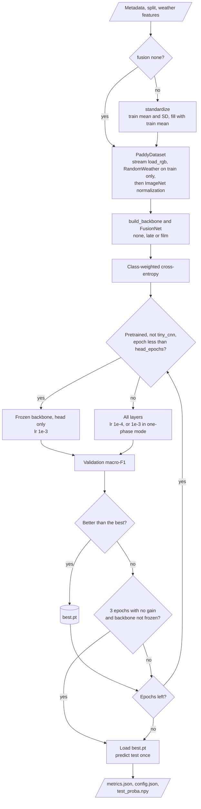

| Fusion | Method |
|---|---|
| `none` | Image features → dropout → linear head |
| `late` | Concatenate image features with a 32-unit weather embedding |
| `film` | Weather gives a scale and a shift for each image feature: f × (1 + γ) + β |

**Procedure**

1. Standardize the weather features with the mean and standard deviation of `train`. Fill missing values with the training mean.
2. Stream the images. Apply `RandomWeather` to training images only, then the ImageNet normalization.
3. Use a class-weighted cross-entropy loss with weights from the training class counts.
4. For a pretrained backbone, train the head for `--head-epochs` (default 3) with a frozen backbone at learning rate `1e-3`.
5. Then train all layers at learning rate `1e-4`.
6. After each epoch, measure the validation macro-F1. Keep the best checkpoint. Stop after 3 epochs with no improvement.
7. Load the best checkpoint and evaluate once on `test`.

`tiny_cnn` trains from random weights in one phase. It is for tests and CPU checks, not for a benchmark.

---

## 11. Metrics and comparisons

`evaluate.py` gives the metrics of one test split, the group intervals and the paired comparison.

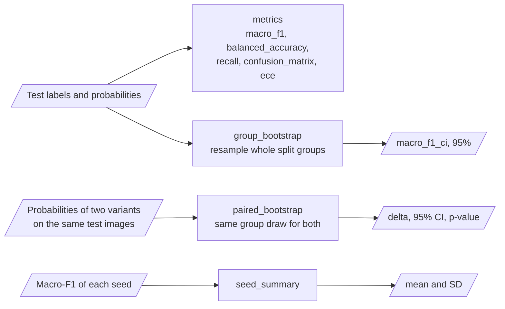

| Metric | Meaning |
|---|---|
| `macro_f1` | Mean F1 over the classes in the test split. The main metric |
| `balanced_accuracy` | Mean recall over the classes |
| `recall` | Recall of each class, by name |
| `confusion_matrix` | Matrix with its class names |
| `ece` | Top-label expected calibration error, 10 bins |
| `macro_f1_ci` | 95% bootstrap interval over split groups |
| Paired comparison | Macro-F1 of image + weather minus image only, with a 95% CI and a p-value from a paired group bootstrap |
| Seed summary | Mean and standard deviation of macro-F1 over the seeds |

---

## 12. The decision rules

The map shows the step where each fixed value applies.

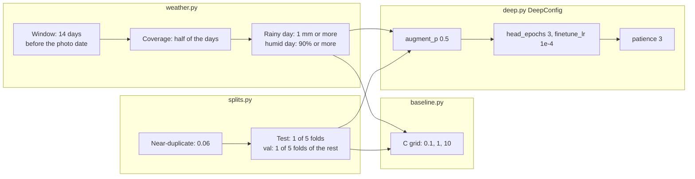

| Value | Where | Number |
|---|---|---|
| Weather window | `PADDYGUARD_WEATHER_LAG_DAYS` | 14 days before the photo date |
| Rainy day | `weather.RAINY_MM` | 1 mm or more |
| Humid day | `weather.HUMID_RH` | 90% or more |
| Minimum window coverage | `window_features` | half of the days |
| Near-duplicate distance | `duplicate_groups(max_distance=...)` | 0.06 mean absolute difference |
| Test split | `assign_splits(test_folds=...)` | 1 of 5 folds |
| Validation split | `assign_splits(val_folds=...)` | 1 of 5 folds of the rest |
| C grid | `baseline.C_GRID` | 0.1, 1, 10 |
| Augmentation probability | `DeepConfig.augment_p` | 0.5 |
| Head epochs, fine-tune rate | `DeepConfig` | 3 epochs, `1e-4` |
| Early stopping | `DeepConfig.patience` | 3 epochs |

---

## 13. Data and file map

| Path | Committed? | Contents |
|---|---|---|
| `data/README.md` | Yes | Sources, layout, columns, weather terms |
| `data/paddy/` | No (git ignores `/data/*`) | Your images and `metadata.csv` |
| `data/synthetic/` | No | Output of `paddyguard synth` |
| `weather_cache/` | No | Cached daily weather (CSV) |
| `runs/weather_features.csv` | No | Output of `paddyguard weather` |
| `runs/<backbone>_<fusion>_seed<n>/` | No | `best.pt`, `config.json`, `metrics.json`, `test_proba.npy` |
| `outputs/augment_preview/` | No | Output of `augment-preview` |
| `.env` | No | Local settings |

---

## 14. How to run paddyguard

### 14.1 Prerequisites

| Need | For |
|---|---|
| Python 3.11+ | All components |
| A labelled paddy image dataset | Real results (see [`data/README.md`](data/README.md)) |
| Location and date for each image | The weather variants |
| Internet access | The `open-meteo` provider only |
| `torch`, `torchvision` (extra `torch`) | `train` and the torch tests |

### 14.2 Installation

```bash
git clone https://github.com/KrishnaAnnavaram/paddyguard.git
cd paddyguard
python -m venv .venv
. .venv/bin/activate            # Windows: .venv\Scripts\activate
pip install -e ".[dev]"         # add ,torch for the deep models
```

### 14.3 Run paddyguard

Offline demo (synthetic data, CPU, about 20 seconds):

```bash
paddyguard demo
```

Step by step. The commands run in this sequence:

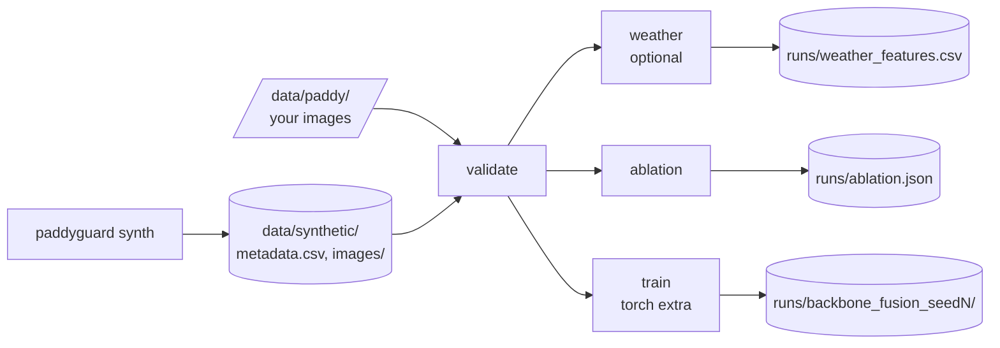

```bash
paddyguard synth --out data/synthetic --fields 30 --photos 25 --seed 0
paddyguard validate --data data/synthetic
paddyguard weather --data data/synthetic --provider offline
paddyguard ablation --data data/synthetic --seeds 0 1 2 --out runs/ablation.json
paddyguard train --data data/synthetic --backbone tiny_cnn --fusion late --epochs 8 --image-size 64 --no-pretrained --seeds 0 1
paddyguard augment-preview --image data/synthetic/images/blast/f000_000.png --size 128
```

On real data with locations and dates:

```bash
export PADDYGUARD_WEATHER_PROVIDER=open-meteo
paddyguard validate --data data/paddy
paddyguard ablation --data data/paddy
paddyguard train --data data/paddy --backbone efficientnet_v2_s --fusion none --seeds 0 1 2
paddyguard train --data data/paddy --backbone efficientnet_v2_s --fusion late --seeds 0 1 2
```

| Command | What it does |
|---|---|
| `synth` | Writes drawn leaf images and `metadata.csv` |
| `validate` | Checks metadata and files, counts near-duplicate groups, reports if the weather branch is available |
| `weather` | Writes the 8 weather features of each image and prints their statistics |
| `ablation` | Image vs. weather vs. image + weather on the same splits and seeds (CPU) |
| `train` | Trains a torch backbone with `none`, `late` or `film` fusion for each seed |
| `augment-preview` | Writes one image with each augmentation |
| `demo` | Synthetic data, validation and the CPU ablation |

Exit codes: 0 for success, 1 for an error (bad metadata, missing files, no weather keys for `weather` or a fusion model, constant weather).

### 14.4 Environment variables

| Variable | Used by | Meaning |
|---|---|---|
| `PADDYGUARD_DATA_DIR` | `config.Settings` | Default data folder (default `data/paddy`) |
| `PADDYGUARD_OUTPUT_DIR` | `weather`, `train` | Run folder (default `runs`) |
| `PADDYGUARD_SEED` | `augment-preview` | Seed (default 42). The ablation and training seeds come from `--seeds` |
| `PADDYGUARD_IMAGE_SIZE` | `train` | Input size (default 224, minimum 16) |
| `PADDYGUARD_WEATHER_PROVIDER` | weather features | `offline` (default) or `open-meteo` |
| `PADDYGUARD_WEATHER_CACHE` | weather features | Cache folder (default `weather_cache`) |
| `PADDYGUARD_WEATHER_LAG_DAYS` | weather features | Window length in days (default 14) |
| `PADDYGUARD_DEVICE` | `train` | `auto`, `cpu` or `cuda` (default `auto`) |

paddyguard needs no credentials. `.env.example` gives the variable names. Git ignores `.env`.

---

## 15. How to extend paddyguard

| You want to… | Do this | Code change? |
|---|---|---|
| Add a weather provider | Write a class with a `daily(latitude, longitude, start, end)` method and add it to `make_provider` | Small |
| Add a weather feature | Add the value in `window_features` and its name in `FEATURES` | Small |
| Add an augmentation | Write a function with the pixel contract and add it to `AUGMENTATIONS` | Small |
| Add a backbone | Add a branch to `deep.build_backbone` and its name to `BACKBONES` | Small |
| Change the window length | Set `PADDYGUARD_WEATHER_LAG_DAYS` | No |
| Add agronomic features (variety, crop age) | Add them as a fourth ablation variant in `baseline.run_ablation` | Yes |

---

## 16. Validation results

All numbers below come from this repository. The model numbers use **synthetic data** (`paddyguard demo`, 30 fields × 25 photos, 6 classes, seed 0). They do not describe real paddy fields.

| Validation | Result | Command |
|---|---|---|
| Unit tests | CI installs only `.[dev]`: **36 passed**, 1 skipped (the torch module, `torch` extra). With the extras: 42 passed | `pytest -q` |
| Metadata check (synthetic) | 750 images, 6 classes, 30 fields, 52 near-duplicate groups | `paddyguard validate` |

CPU ablation on synthetic data, 3 seeds:

| Variant | Macro-F1, mean ± SD over 3 seeds | First seed (95% group CI) |
|---|---|---|
| `image` | 0.935 ± 0.025 | 0.907 (0.860–0.949) |
| `weather` | 0.267 ± 0.008 | 0.266 (0.219–0.299) |
| `image+weather` | 0.933 ± 0.025 | 0.904 (0.849–0.961) |

| Comparison or test | Result |
|---|---|
| `image+weather` minus `image`, first seed | −0.002, 95% paired CI −0.014 to +0.032, p = 0.970 |
| Image model on augmented test images (macro-F1) | clean 0.907, fog 0.033, haze 0.065, rain 0.239, brightness 0.698, shadow 0.710, motion blur 0.282 |

`tiny_cnn` on the same synthetic data (CPU, 8 epochs, 64 px, augmentation on, seeds 0 and 1):

| Fusion | Test macro-F1, seed 0 | Test macro-F1, seed 1 |
|---|---|---|
| `none` | 0.680 | 0.599 |
| `late` | 0.737 | 0.753 |
| `film` | 0.738 | 0.766 |

With the small CNN, the image branch is weaker, and both fusion modes give a higher macro-F1 on both seeds. Two seeds are not enough for a significance claim.

The weather-only variant is above the chance level of 0.167, so the weather features carry information. The image features already separate the classes well, so the fusion adds no significant macro-F1 on this data.
The robustness test shows that the image model trained with no augmentation fails on fog and haze. This result supports augmentation in training.
These results prove that the ablation and the checks work. They do not answer the question for real fields.

The prototype reported an accuracy for EfficientNetV2-L with a weather branch. That number is a prototype result, not reproduced here. Its weather input was one constant vector for all images, so this project does not compare with it.

---

## 17. Known problems

Read these problems before you use paddyguard for a publication.

| # | Area | Problem | Impact and action |
|---|---|---|---|
| 1 | Real data | CI runs on synthetic data only. Results on real images are not reproduced in CI | Run `ablation` and `train` on your data and report the seeds |
| 2 | Metadata | Most public paddy datasets have no location and no date for each photo | Without them, paddyguard can only train the image-only model |
| 3 | Weather grid | Open-Meteo gives gridded reanalysis data, not a field station | Small fields in one grid cell get the same weather |
| 4 | Near-duplicates | The thumbnail rule finds re-saves and second shots. It can miss a shot from another angle | Give a real `field_id` or plant ID when you have one |
| 5 | Class balance | Field datasets are often imbalanced | Read the recall of each class, not only macro-F1 |
| 6 | Synthetic images | The drawn leaves are much simpler than photos | Do not read the synthetic macro-F1 as a real performance |
| 7 | CPU speed | `efficientnet_v2_s` and `convnext_tiny` at 224 px are slow on a CPU | Use a GPU. The CPU path is for tests and small checks |
| 8 | Torch tests | CI installs only `.[dev]`, so the 6 torch tests skip in CI | Run `pip install -e ".[dev,torch]" && pytest` before a release |
| 9 | Advice | paddyguard gives a class, not a treatment | An agronomist must confirm a diagnosis before any spray decision |

---

## 18. Key points

1. **Weather is real or absent.** Each image gets the weather of its own place and time, and a constant weather vector stops the run.
2. **No leak through augmentation.** Splits come first, and augmentation runs on training images only.
3. **Fields and near-duplicates stay together.** Grouped splits keep them on one side.
4. **The claim is tested, not assumed.** Three variants, the same splits and seeds, and a paired bootstrap answer the weather question.
5. **One pixel scale.** Float32 RGB in [0, 1] from the file to the normalization step.
6. **It runs offline.** Synthetic data, offline weather and the CPU ablation need no key and no GPU.

---

## 19. Glossary

| Term | Meaning |
|---|---|
| **class** | One disease or health label |
| **field** | The group of images from one farm, plot or plant |
| **near-duplicate** | An image with a thumbnail signature close to another image of the same class |
| **split group** | Images joined by a shared field or a near-duplicate link |
| **weather window** | The days before the photo date that give the weather features |
| **weather features** | The 8 values from the weather window |
| **provider** | The source of daily weather: `offline` or `open-meteo` |
| **augmentation** | A weather-style change of a training image |
| **pixel contract** | float32 RGB values in [0, 1] |
| **variant** | `image`, `weather` or `image+weather` |
| **ablation** | The comparison of the variants on the same splits and seeds |
| **fusion** | How a torch model uses weather: `none`, `late` or `film` |
| **FiLM** | Feature-wise linear modulation: a scale and a shift for each feature |
| **macro-F1** | Mean F1 over the classes in the test split |
| **paired bootstrap** | A resample of split groups that measures two models on the same draw |

---

## 20. License

[MIT](LICENSE) © 2026 Krishna Annavaram
